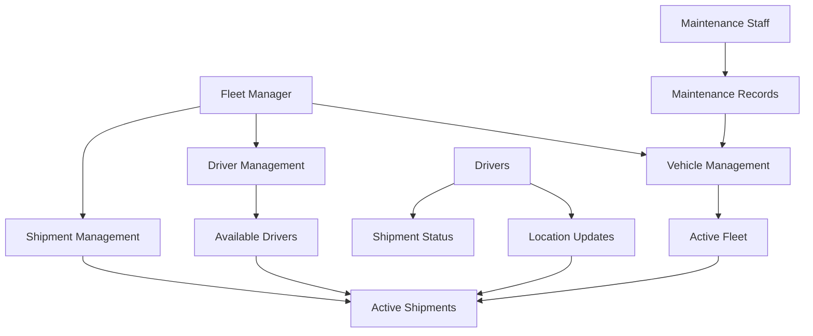

# Fleet Logistics Tracking System (FleetTrack)

A comprehensive blockchain-based solution for transparent and immutable tracking of logistics fleet operations on the Stacks blockchain.

## Overview

FleetTrack provides a complete system for managing and tracking logistics fleet operations with the following key features:

- Vehicle and driver registration and management
- Shipment lifecycle tracking
- Real-time location updates
- Maintenance scheduling and recording
- Role-based access control
- Transparent and immutable record-keeping

## Architecture

The system is built around several core components that work together to manage the complete logistics lifecycle:



### Core Components:
- Roles and Permissions System
- Vehicle Registry
- Driver Management
- Shipment Tracking
- Location Updates
- Maintenance Records

## Contract Documentation

### Role Management
The contract implements a comprehensive role-based access control system with the following roles:
- Admin
- Fleet Manager
- Driver
- Maintenance Staff

### Data Maps
- `vehicles`: Stores vehicle information and current status
- `drivers`: Maintains driver records and assignments
- `shipments`: Tracks all shipment details
- `location-updates`: Records vehicle location history
- `maintenance-records`: Stores vehicle maintenance history

## Getting Started

### Prerequisites
- Clarinet CLI installed
- Stacks blockchain environment

### Installation
1. Clone the repository
2. Install dependencies with Clarinet
3. Deploy the contract to your chosen network

### Basic Usage

1. Set up roles:
```clarity
(contract-call? .fleet-track set-role 
    'ST1PQHQKV0RJXZFY1DGX8MNSNYVE3VGZJSRTPGZGM 
    true true false false)
```

2. Register a vehicle:
```clarity
(contract-call? .fleet-track register-vehicle 
    "TRUCK001" "Volvo" "VNL860" u2023 "1HGCM82633A123456")
```

3. Register a driver:
```clarity
(contract-call? .fleet-track register-driver 
    'ST1PQHQKV0RJXZFY1DGX8MNSNYVE3VGZJSRTPGZGM 
    "John Doe" "DL123456" u1735689600)
```

## Function Reference

### Vehicle Management
```clarity
(register-vehicle (vehicle-id (string-utf8 50)) (make (string-utf8 50)) (model (string-utf8 50)) (year uint) (vin (string-utf8 50)))
(update-vehicle-status (vehicle-id (string-utf8 50)) (new-status (string-utf8 20)))
```

### Shipment Management
```clarity
(create-shipment (vehicle-id (string-utf8 50)) (driver-id principal) (origin (string-utf8 100)) (destination (string-utf8 100)) (cargo-description (string-utf8 255)))
(start-shipment (shipment-id uint))
(update-location (shipment-id uint) (location (string-utf8 100)) (miles-added uint))
(complete-shipment (shipment-id uint))
```

### Maintenance Management
```clarity
(record-maintenance (vehicle-id (string-utf8 50)) (maintenance-type (string-utf8 50)) (description (string-utf8 255)) (next-maintenance-due uint) (odometer-reading uint))
(schedule-maintenance (vehicle-id (string-utf8 50)))
```

## Development

### Testing
Run the test suite using Clarinet:
```bash
clarinet test
```

### Local Development
1. Start local Clarinet console:
```bash
clarinet console
```
2. Deploy contract and test functionality in REPL environment

## Security Considerations

### Access Control
- Only authorized roles can perform specific actions
- Contract owner has special privileges for role management
- Drivers can only update their own shipments

### Data Validation
- All inputs are validated for correct formats and ranges
- Status transitions are strictly controlled
- Vehicle maintenance requirements are enforced

### Limitations
- No real-time tracking capability (updates are transaction-based)
- Limited to Stacks block confirmation times for updates
- Maintenance schedules are basic and may need manual oversight